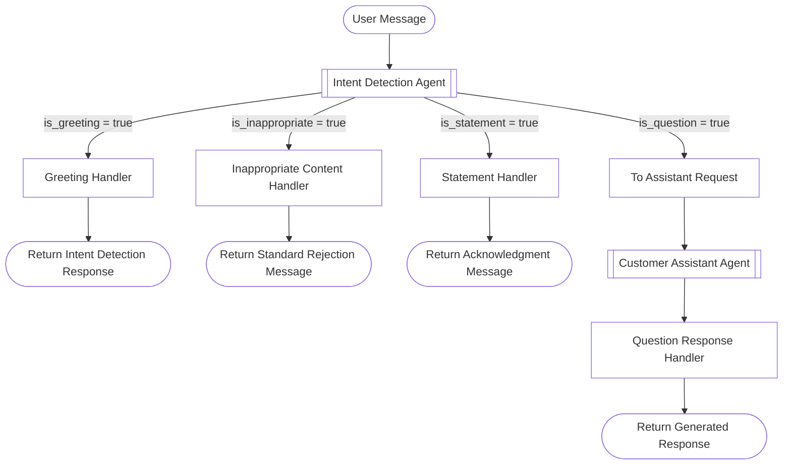

# Microsoft Agent Framework - Workflow Samples

This is a sample project demonstrating how to build a workflow using Microsoft
Agent Framework (MAF) to handle different types of user messages, including
greetings, questions, inappropriate content, and general statements.

It uses Microsoft Agent Framework's Workflow API to create a workflow that
processes user messages through various agents and handlers based on the intent
detected in the message.

## User Case

The use case is user sends in a message, and based on the content of the
message, the workflow routes the message to different handlers. The message can
be one of the following types:

- Greeting: A friendly greeting message (e.g., "Hello", "Hi there!").
- Question: A message that contains a question or request for information (e.g.,
  "What is 1 + 1?").
- Inappropriate Content: A message that contains inappropriate or offensive
  content (e.g., "You are stupid!").
- General Statement: A message that is a general statement or comment (e.g., "I
  love programming.").

In this above use case, we want to make sure that we handle each type of message
appropriately. And only use LLM when necessary (i.e., for questions). When it is
a greeting, the first LLM agent already generates a response, so we just return
that. When it is inappropriate content, we return a standard message indicating
that the content is not acceptable. For general statements, we return a standard
acknowledgment message. For questions, we route the message to an assistant
agent to generate a response.

## Implementation Details



> In the diagram above, each node represents an agent or handler in the
> workflow, the square brackets indicate handlers, and the double square
> brackets indicate agents. The arrows show the flow of messages based on the
> detected intent.

The workflow starts with an intent detection agent that analyzes the user's
message to determine its intent. Based on the detected intent, the workflow
routes the message to the appropriate handler:

1. If the message is a greeting, it is handled by the greeting handler.
   - the greeting handler just returs the response that is already generated by
     the intent detection agent.
2. If the message is inappropriate, it is managed by the inappropriate content
   handler.
   - the inappropriate content handler returns a standard message indicating
     that the content is not acceptable.
3. If the message is a general statement, it is processed by the statement
   handler.
   - the statement handler returns a standard message acknowledging the
     statement.
4. If the message is a question, it is processed by the question response
   handler.
   - the question response handler generates a response to the user's question
     using an assistant agent.

Essentially, the intent detection agent acts as a decision-maker, directing the
flow of messages to the appropriate handlers based on their content. It
generates a JSON object with the following fields:

- is_greeting (bool): true if the message is a greeting, false otherwise.
- is_question (bool): true if the message is a question or request for
  information, false otherwise.
- is_inappropriate (bool): true if the message is inappropriate, false
  otherwise.
- is_statement (bool): true if the message is a general statement, false
  otherwise.
- response (string): Generate a response to the message only if it is a
  greeting. For all other message types, return an empty string.

Here is the pydantic model representing the intent detection result:

```python
from pydantic import BaseModel

class IntentDetectionResult(BaseModel):
    message_content: str = Field(..., description="The original message content.")
    is_greeting: bool
    is_inappropriate: bool
    is_question: bool
    is_statement: bool
    response: str = Field(
        ...,
        description="Generated response to the message if it is a greeting;
        empty string otherwise.",
    )
```

## Running the Sample

To run the sample workflow, execute the following command in your terminal:

```bash
uv run python -m main "Your message here"
```
